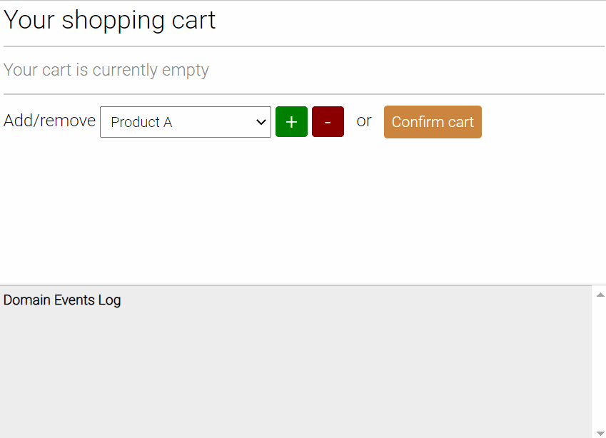

# Akka.NET Finite State Machine Demo
This is an ASP.NET Core **demo project** using [Akka.NET](https://getakka.net/) to model a simple shopping cart that goes through 3 states:
  * `Empty` you can only add products in this state. Remove and confirm are not allowed here;
  * `NonEmpty` you can add products, remove existing products or confirm the cart;
  * `Confirmed` no more commands are acceptable in this state. The cart is effectively "frozen";

This behavior is modeled by the [Models/Actors/CommandHandlers/CartActor.cs](Models/Actors/CommandHandlers/CartActor.cs) file. Take a look at that, first.

## Domain events
Upon receiving a command, the `CartActor`:
  1. **Validates** the command (e.g. ensures the product name is non-empty when you send an [AddProduct](Models/Commands/AddProduct.cs) command);
  2. **Handles** the command by **creating a domain event** such as [ProductAdded](Models/DomainEvents/ProductAdded.cs) and persists that event to a durable storage (a Sqlite database, in this case);
  3. **Applies** the domain event by mutating the cart state (e.g. adds a [CartLine](Models/Dtos/CartLine.cs) to the [CartState](Models/Dtos/CartState.cs).

## Recovering from faults
Should the `CartActor` stop working due to an unhandled exception or an application restart, the [Akka.NET Actor System](https://getakka.net/articles/concepts/actor-systems.html) will respawn a new `CartActor` and make it **re-apply all previous domain events in the same order they were persisted**.

 > To "_re-apply_" here means to re-do only step 3 from the previous paragraph. In fact, there's no need to re-validate or re-handle commands, since we're not dealing with commands anymore. We're just dealing with those domain events that were persisted to the storage.

This way, the `CartActor` will recover its previous cart state, as if nothing happened. We can say the `CartActor` is fault-tolerant.

## Side effects
Whenever a domain event is persisted to the storage, a typical application will want handle that event and trigger one or more side effects (e.g send an email when the domain event `CartConfirmed` is persisted). Enacting side effects should be completely **asynchronous and independent** of the `CartActor` because they usually take long to complete and may even fail often when dealing with third party services or devices over the network.

This project ensures side effects are enacted asynchronously by querying the storage with the [Akka.NET Persistence Query](https://getakka.net/articles/persistence/persistence-query.html). You can see it being created in the [Models/Services/Infrastructure/ActorSystemAccessor.cs](Models/Services/Infrastructure/ActorSystemAccessor.cs#L78) file.

> Warning note: this project provides just a demo implementation. Its only side effect is echoing domain events to clients. Usually, you'll want to track which events have been handled so they won't produce duplicated side effects (e.g. email being sent again when the application is restarted).

## Message exchange
In this particular project, commands are sent by a browser client by interacting with the HTML interface that's in the [wwwroot/index.html](wwwroot/index.html) file.

The HTML interface uses the [MQTT.js](https://github.com/mqttjs/MQTT.js) JavaScript library to relay commands to an MQTT server, that's been implemented in this very same application using [MQTTnet](https://github.com/chkr1011/MQTTnet). Take a look at the [Startup.cs](Startup.cs#L50) file for its configuration.

> Why MQTT and not [ASP.NET Core SignalR](https://docs.microsoft.com/en-us/aspnet/core/signalr/introduction), you ask? Well, because for this demo I needed to experiment with some extended features, such as _QoS levels_, _retaining messages_ and the _request/response pattern_. SignalR is not providing any of that out of the box.

Whenever a domain event is persisted, it's also echoed to connected clients via MQTT as a side effect. You can see it happening in the [Models/Actors/EventHandlers/NotificationActor.cs](Models/Actors/EventHandlers/NotificationActor.cs) file.

## TODOs
You'll find some `//TODO` comments scattered in the project. Those are notes for future updates that might come in this demo. Again, **this is just a demo project so it cannot be used in production as it is.**